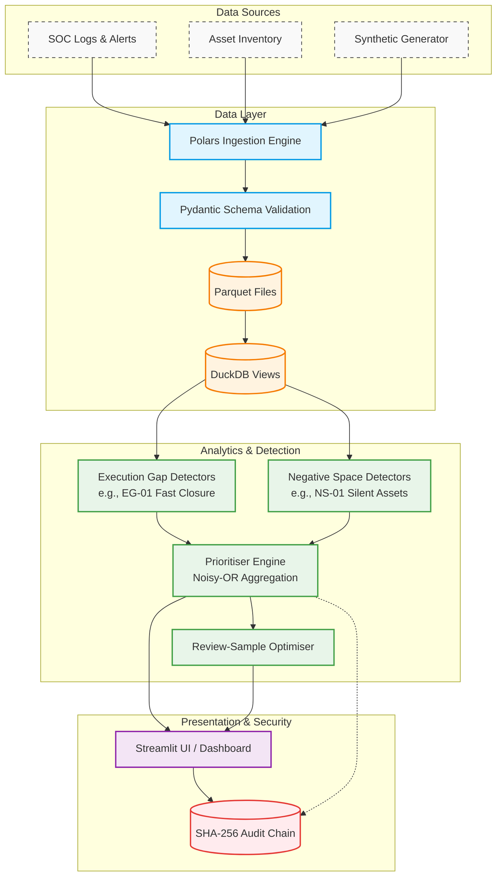

# SAT-SA: System Architecture & Data Flow

This document visualizes the complete end-to-end architecture of the SAT-SA platform and explains the responsibility of each component in the pipeline.

## Architecture Diagram

---

## Component Explanation

The SAT-SA pipeline operates in distinct, decoupled phases. This batch-oriented approach ensures stability and allows for easy auditing of the data at any point in the lifecycle.

### 1. Data Sources (The Inputs)
*   **SOC Logs / Asset Inventory:** In a production environment, CSEs provide CSV or JSON dumps of their incident management systems and asset registries.
*   **Synthetic Generator:** For demonstration and validation, a local Python script generates statistically realistic baselines and injects known flaws (Ground Truth) to simulate real SOC data.

### 2. Data Layer (Storage & Ingestion)
*   **Polars Ingestion Engine:** Reads raw data at lightning speed. It handles mapping varying column names to our canonical standard.
*   **Pydantic Schema Validation:** Enforces strict data types (e.g., ensuring timestamps are valid dates, severities are integers). Bad data is flagged by the Data Quality engine rather than silently failing.
*   **Parquet & DuckDB:** Processed data is saved as highly compressed Parquet files. DuckDB maps directly to these files, allowing us to execute complex SQL queries across millions of rows without loading the entire dataset into RAM.

### 3. Analytics & Detection (The "Brains")
*   **Execution Gap (EG) Detectors:** SQL-driven logic that looks for operational failures, such as high-severity alerts being closed suspiciously fast without escalation.
*   **Negative Space (NS) Detectors:** Logic that explicitly searches for the *absence* of data, such as a Critical Server that hasn't produced a single log entry in 30 days.
*   **Prioritiser Engine:** Takes all findings and maps them to 8 PS Capability Areas. It uses a Noisy-OR mathematical function to calculate a final "Attention Index" that fairly ranks which entities are the highest risk.
*   **Review-Sample Optimiser:** Rather than giving human auditors a random list of cases, this module stratifies the findings based on the Attention Index to provide a statistically optimized list of cases to review, maximizing the discovery of real weaknesses.

### 4. Presentation & Security
*   **Streamlit UI:** A fully featured, local web dashboard. It displays the ranked Portfolio Overview, the precise "Finding Cards" (evidence), and raw data tables.
*   **SHA-256 Audit Chain:** A tamper-evident cryptographic ledger. Every time data is ingested, or an assessment is run, a new block is appended to the chain. The UI features a "Verify" button that recalculates all hashes to prove that the findings and reports have not been altered or deleted.
